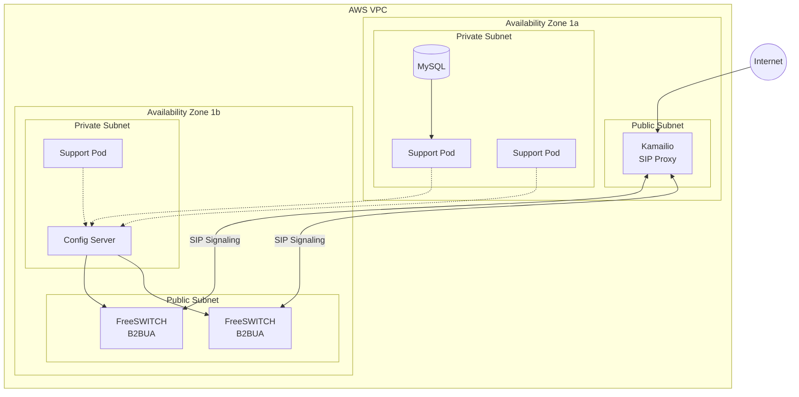

```mermaid
flowchart TB

Internet((Internet))

subgraph AWS["AWS VPC"]

subgraph AZ1["Availability Zone 1a"]

subgraph PUB1["Public Subnet"]
KAM["Kamailio<br/>SIP Proxy"]
end

subgraph PRIV1["Private Subnet"]
DB[(MySQL)]
CONS1["Support Pod"]
CONS2["Support Pod"]
end

end

subgraph AZ2["Availability Zone 1b"]

subgraph PUB2["Public Subnet"]
FS1["FreeSWITCH<br/>B2BUA"]
FS2["FreeSWITCH<br/>B2BUA"]
end

subgraph PRIV2["Private Subnet"]
BACK["Config Server"]
CONS3["Support Pod"]
end

end

end

Internet --> KAM

KAM <-->|SIP Signaling| FS1
KAM <-->|SIP Signaling| FS2

BACK --> FS1
BACK --> FS2

CONS1 -.-> BACK
CONS2 -.-> BACK
CONS3 -.-> BACK

DB --> CONS1
```
